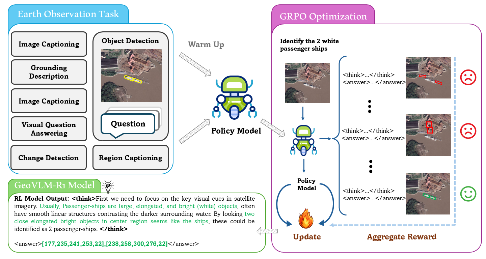
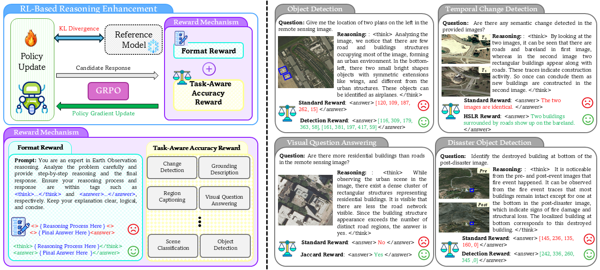
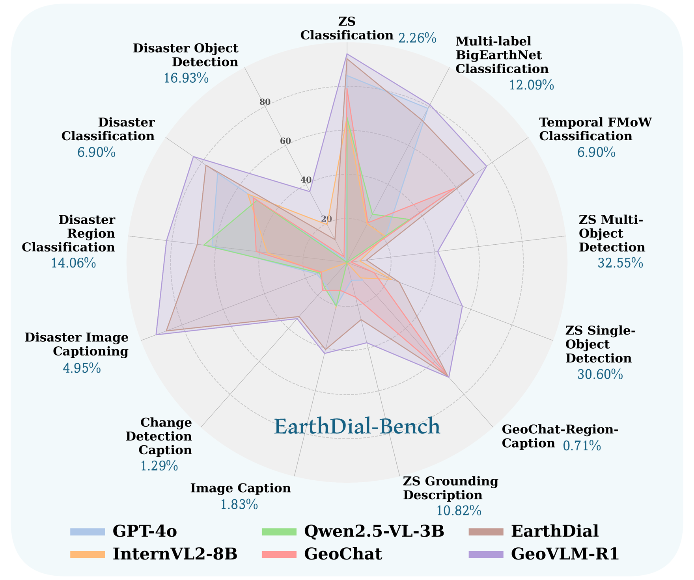

# GeoVLM-R1 : Reinforcement Fine-Tuning for Improved Remote Sensing Reasoning
<p align="center">
    
</p>

#### [Mustansar Fiaz](https://sites.google.com/view/mustansarfiaz/home), [Hiyam Debary](https://www.linkedin.com/in/hiyam-debary/), Paolo Fraccaro, [Danda Paudel](https://insait.ai/dr-danda-paudel/), [Luc Van Gool](https://insait.ai/prof-luc-van-gool/), [Fahad Khan](https://sites.google.com/view/fahadkhans/home), and [Salman Khan](https://salman-h-khan.github.io/)


#### **IBM Research, INSAIT, ETH Zürich, Mohamed bin Zayed University of AI, Linköping University, Australian National University**

[](https://mustansarfiaz.github.io/GeoVLM-R1/)
[](https://www.arxiv.org/abs/2509.25026)
[]()

---

## 📢 Latest Updates
- **Oct-07-2025**: We will open-source the code, model, dataset, and evaluation scripts, which are coming soon. 
- **Oct-07-2025**: Our model checkpoints will be released on HuggingFace.
- **Sep-30-2025**: GeoVLM-R1 paper is released [arxiv link](https://www.arxiv.org/abs/2509.25026). 🔥🔥
- **Sep-30-2025**: GeoVLM-R1 2025 project is live. 🔥🔥
---

## Overview

Earth Observation (EO) tasks introduce unique challenges, spanning referred object detection, image/region captioning, change detection, grounding, and temporal analysis, that demand task-aware reasoning. We propose a novel post-training framework that incorporates task-aware rewards to enable effective adaptation of reasoning-based RL models to diverse EO tasks. This training strategy enhances reasoning capabilities for remote-sensing images, stabilizes optimization, and improves robustness. Extensive experiments across multiple EO benchmarks show consistent performance gains over state-of-the-art generic and specialized vision–language models

---

## Install

1. Clone this repository and navigate to GeoVLM-R1-Toolkit folder
```bash
git clone https://github.com/mustansarfiaz/GeoVLM-R1-Toolkit.git
cd GeoVLM-R1-Toolkit
```

2. Install Package
```Shell
conda create -n GeoVLM-R1-Toolkit python=3.10 -y
conda activate GeoVLM-R1-Toolkit
pip install --upgrade pip  # enable PEP 660 support
pip install -e .
```

3. Install additional packages for training cases
```
pip install torch==2.5.1 torchvision==0.20.1 torchaudio==2.5.1 --index-url https://download.pytorch.org/whl/cu121
pip install -r requirements.txt 
pip install qwen-vl-utils
pip install ninja
pip install flash-attn --no-build-isolation
pip install modelscope, math_verify, openai, json_repair
pip install --upgrade typing_extensions
pip install openai
pip install json_repair
pip install trl==0.17.0
pip install transformers==4.49.0
pip install math_verify
pip install Babel
```

---
## 🏆 Contributions

- **GeoVLM-R1: A specialized VLM for high-resolution remote sensing image Reasoning.** We propose GeoVLM-R1, a reinforcement learning framework that encourages VLM to enhance its reasoning capabilities with flexibility, scalability, and ease of experimentation in mind for diverse EO tasks.
 using their corresponding datasets. This results in a total of 318k instruction pairs for RS domain.
- **Reward Mechanism.** We have a sophisticated reward mechanism, enabling effective RL in EO reasoning contexts. To generate structurally coherent and semantically accurate reasoning outputs, we introduce format and task-aware accuracy rewards to better guide reasoning optimization.  

- **Evaluation Benchmark.** Our experimental results demonstrate the effectiveness of GeoVLM-R1 on multiple challenging EO tasks. Experimental results on 28 downstream benchmarks show that our method performs well compared to existing VLMs and achieves better performance, demonstrating its merits.

---
## 👁️💬 GeoVLM-R1: RL Training Paradigm

Illustration of the overall proposed training paradigm for GeoVLM-R1. The model is first initialized via supervised fine-tuning using diverse earth observation tasks. It is then successively optimized using GRPO-based reinforcement learning (RL) for each task. The GeoVLM-R1 processes queries and outputs a structured format that comprises an interpretable reasoning trace (<think> ... </think>) and a final prediction (<answer> ...</answer>). 

<p align="center">
  
</p>

---

## 🛰️ GeoVLM-R1: RL Policy Update Mechanism

Overall pipeline of GeoVLM-R1 policy update mechanism (left). During fine-tuning, the GRPO module generates multiple candidate responses. These responses are evaluated, and each is assigned a distinct reward equipped with our reward mechanism. In particular, our reward mechanism comprises (i) a format reward to enforce structural compliance and (ii) a task-aware accuracy reward to ensure accuracy compliance. We present a few examples showcasing GeoVLM-R1 using a unique task-aware accuracy reward function, resulting in better performance (right).

<p align="center">
  
</p>

---

## 🔍 State-of-the-art Comparison across EO Tasks

Comparison of recent generic and specialized VLMs over diverse EO tasks. GeoVLM-R1 shows favorable improvements across classification, detection, and captioning tasks.

<p align="center">
  
</p>


## 📊 Image Classification Task

GeoVLM-R1 illustrates a consistent improvement among zero-shot (ZS), multi-label BigEarthNet, 
and temporal classification datasets compared to other existing VLMs.

| Model          | AID (ZS) | UCMerced (ZS) | WHU-19 (ZS) | BigEarthNet | xBD Set 1 (Temporal) | FMoW (Temporal) |
|----------------|----------|---------------|-------------|-------------|-----------------------|-----------------|
| GPT-4o         | 74.73    | 88.76         | 91.14       | 49.00       | 67.95                 | 21.43           |
| InternVL-8B    | 60.40    | 58.23         | 79.30       | 19.73       | 51.44                 | 21.04           |
| Qwen2.5-VL-3B  | 58.27    | 60.86         | 78.21       | 24.75       | 51.44                 | 34.36           |
| GeoChat        | 72.03    | 84.43         | 80.09       | 20.35       | 53.32                 | 59.20           |
| EarthDial      | **88.76**| 92.42         | 96.21       | 73.03       | 96.37                 | 70.03           |
| **GeoVLM-R1**  | 88.46    | **97.81**     | **97.91**   | **80.91**   | **98.93**             | **76.93**       |

## 📊 Referred Object Detection, Region-Captioning, Grounding Description Tasks

GeoVLM-R1 illustrates a consistent performance gain across referred object detection, 
region-captioning, and grounding description tasks.

| Model         | Referred Object Detection Task                      |                          | Region-Captioning Task      |                          | Grounding Task           |           |         |
|---------------|----------------------------------------------------|--------------------------|----------------------------|--------------------------|-------------------------|-----------|---------|
|               | GeoChat-Instruct                                   | NWPU VHR-10 (Zero-Shot) | GeoChat-Instruct           | NWPU VHR-10 (Zero-Shot) | NWPU VHR-10 (Zero-Shot)|           |         |
|               | Small | Med. | Large | Single | Mult.             | Small | Med. | Large | Single | Mult. | Rouge1 | Rouge-L | Meteor | Rouge1 | Rouge-L | Meteor | @0.5 | @0.25 | Rouge1 | Rouge-L | Meteor |
| GPT-4o        | -     | -    | -     | -      | -                  | -     | -    | -     | -      | -     | 9.41   | 7.6     | 8.02   | 17.68  | 11.81  | 9.63   | 0.7  | 6.1   | 14.72 | 10.82 | 9.41  |
| InternVL2-4B  | 6.3   | 24.37| 37.38 | 24.96  | 11.72              | 7.1   | 12.68| 25.48 | 22.96  | 8.1   | -      | -       | -      | -      | -      | -      | 10.6 | 29.87 | 30.67 | 29.09 | 21.92 |
| InternVL2-8B  | 7.20  | 23.76| 31.99 | 25.77  | 9.30               | 4.26  | 11.85| 20.72 | 21.66  | 5.86  | 10.58  | 9.06    | 8.5    | 11.88  | 9.63   | 7.7    | -    | -     | -     | -     | -     |
| GeoChat       | 2.9   | 13.6 | 21.7  | 16     | 4.3                | 2.5   | 3.2  | 14.7  | 13.23  | 1.9   | 72.77  | 72.74   | 61.9   | 62.02  | 62.02  | 53.31  | 2.2  | 15.27 | 21.46 | 20.74 | 21.38 |
| EarthDial     | 11.43 | 31.76| 39.07 | 34.29  | 13.41              | 11.66 | 14.21| 23.12 | 25.37  | 8.9   | 73.38  | 73.34   | 62.72  | **72.14** | **72.14** | **60.01** | 17.07 | 41.00 | 27.05 | 26.35 | 23.12 |
| **GeoVLM-R1** | **36.02** | **54.72** | **55.03** | **57.1** | **35.04** | **34.44** | **48.76** | **64.91** | **55.97** | **41.45** | **75.92** | **75.9** | **66.43** | 72.10 | 72.10 | 55.49 | **38.74** | **61.45** | **31.31** | **30.08** | **26.10** |


---

## 📜 Citation
```bibtex
  @article{fiaz2025geovlmr1,
          title={GeoVLM-R1: Reinforcement Fine-Tuning for Improved Remote Sensing Reasoning}, 
          author={Mustansar Fiaz, Hiyam Debary, Paolo Fraccaro, Danda Paudel, Luc Van Gool, Fahad Shahbaz Khan, Salman Khan},
          journal={ArXiv},
          year={2025},
          url={https://arxiv.org/pdf/2509.25026}
        } 
```
## 🙏 Acknowledgement
We are thankful to [Qwen2-VL Series](https://github.com/2U1/Qwen2-VL-Finetune) and [VLM-R1](https://github.com/om-ai-lab/VLM-R1) for releasing their models and code as open-source contributions.

---
[](https://ibm.com/)
[](https://insait.ai/)
[](https://ethz.ch/en.html)
[](https://mbzuai.ac.ae)
[](https://liu.se/en)
[](https://www.anu.edu.au/)

